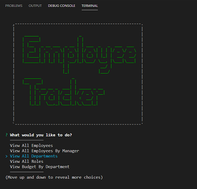

# 12-Employee_Tracker


:construction:   IN PROGRESS  :construction:   

---

 <a href="https://img.shields.io/badge/node-v12.19.0-orange?style=plastic"></a>
<a href="https://img.shields.io/badge/npm-Inquirer-red?style=plastic"></a> 
<a href="https://img.shields.io/badge/npm-MySQL-yellow?style=plastic"></a>
<a href="https://img.shields.io/badge/npm-console.table-blue?style=plastic"></a>
 <a href="https://img.shields.io/badge/License-MIT-brightgreen?style=plastic"></a>  

---

## Table of Contents  
* [Description](#Description)
* [User Story and Details](#User-Story-and-Details)  
* [Installation and Usage](#Installation-and-Usage)  
* [Images of the app](#Images-of-the-app-)  
* [License](#License)  
* [Contact](#Contact) 


## Description
This command-line application is a **C**ontent **M**anagement **S**ystems: it allows you to view and manage the departments, roles, and employees in a company. It will use [inquirerJs](https://www.npmjs.com/package/express), [MySQL](https://www.npmjs.com/package/mysql) and [console.table](https://www.npmjs.com/package/console.table).  


## User Story and Details


```
User Story Acceptance Criteria
```
```
AS a business owner, I want to be able to view and manage the departments, roles, and employees in my company
SO that I can organize and plan my business by adding, updating, deleting employees or managers,and viewing employees by managers.


```

:information_source:  
The database schema should contain:  
* **department**:

  * **id** - INT PRIMARY KEY
  * **name** - VARCHAR(30) to hold department name

* **role**:

  * **id** - INT PRIMARY KEY
  * **title** -  VARCHAR(30) to hold role title
  * **salary** -  DECIMAL to hold role salary
  * **department_id** -  INT to hold reference to department role belongs to

* **employee**:

  * **id** - INT PRIMARY KEY
  * **first_name** - VARCHAR(30) to hold employee first name
  * **last_name** - VARCHAR(30) to hold employee last name
  * **role_id** - INT to hold reference to role employee has
  * **manager_id** - INT to hold reference to another employee that manages the employee being Created. This field may be null if the employee has no manager. 


## Installation and Usage  

- Open a terminal instance  
- Clone the following [repo](https://github.com/Delph-Sunny/12-Employee_Tracker)  
- In the working directory, install the dependencies package with the following code line `npm i`  
- Once the dependencies have been installed, enter `npm start`  
- 
  

## Images of the App :mag:  
  
  
  

## License  

Copyright (c) 2021 DT. This project is [MIT](https://choosealicense.com/licenses/mit) licensed.

## Contact  

:octocat:  GitHub: [Delphine](https://github.com/Delph-Sunny)  


---